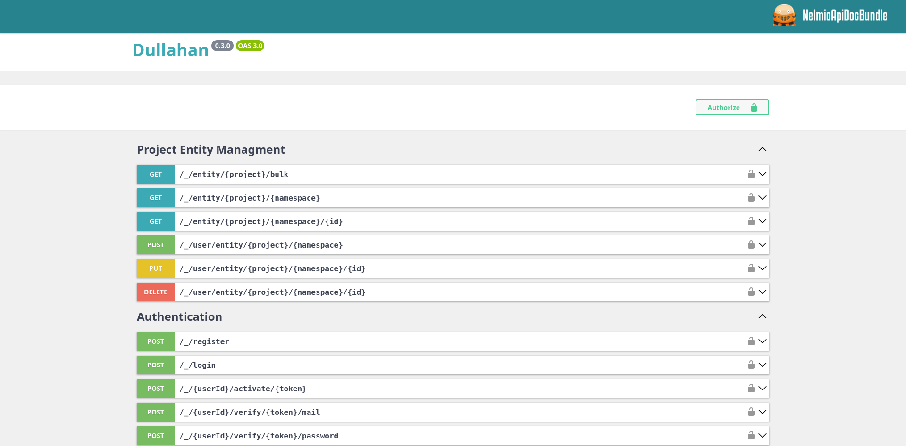

# Rest API

Dullahan allows for communication with architectural style of [Rest API](https://www.ibm.com/think/topics/rest-apis).
Any route related to Dullahan is prefixed with `/_/` as to separate it from default system route matching.
Routes that starts with the space (`/_/`) are automatically handled by the Dullahan. For example any exception that
happened in the headless namespace (`/_/`) will be transformed to the default JSON response automatically.

## Standardized Response

Each End Point will return a response in the same format:

```js
{
  "message": "Human readable message",
  "status": 200,
  "success": true,
  "data": {
    // Anything goes here
  },
  "offset": null,
  "limit": null,
  "total": null,
  "errors": []
}
```

:::tip Extended response
Depending on the installed modules the response might have additional fields but the core of it should stay the same
:::

## Automatic error conversion

When error occurs inside the `space` routes it will be automatically converted into the standard response format, except
for Type Error, Memory Overflow Errors and similar. That means that Dullahan implements centralized error handling
architecture and if EP has been created inside `space`  namespace you don't have to worry about setting try-catch blocks
just to convert your error to the response.

```js title="/_/register"
{
  "message": "Registration attempt failed",
  "status": 400,
  "success": false,
  "data": [],
  "offset": null,
  "limit": null,
  "total": null,
  // Errors can be either and array of strings
  // or an graph with array of strings as the end node
  "errors": {
    "email": [
      "User with this e-mail already exists"
    ],
    "username": [
      "User with this name already exists"
    ]
  }
}
```

## Automatic OpenAPI documentation

Each REST API EP is described using
[NelmioApiDoc Bundle](https://symfony.com/bundles/NelmioApiDocBundle/current/index.html) attributes and allows for
interactive API documentation using OpenAPI 3.0 standard. This means that you can access and browse all Dullahan EP by
entering `/api/doc`:



