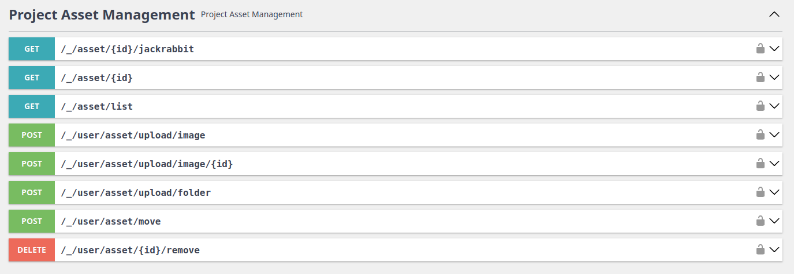

# Intro

Asset bundle is responsible for managing asset like documents or images. It gives you an ability to handle assets,
generate thumbnails, define relations between objects and images while abstracting the chosen file system solution.
It comes packed with implementation of hierarchical database Jackrabbit Apache to store your assets safely in
virtual environment. It comes with build in integration with [User Bundle](/docs//dullahan/user/README.md),
[Entity Bundle](/docs/dullahan/entity/README.md) and REST API for managing your assets.

