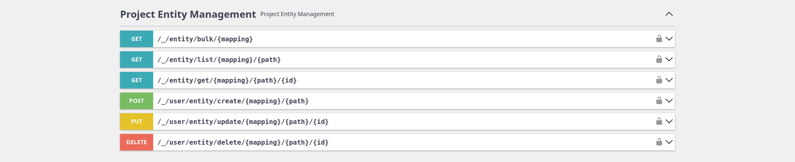

# Intro

Entity bundle is responsible for dataset definition. Manages object life cycle (CRUD), access permissions, bulk actions,
pagination, automatic caching, inheritance and more. It is robust module for defining
data structure with ready to use REST interfaces allowing to focus only on schema creation. It comes with automatic
definitions to allow making UI builders for entities and build in integration with
[User Bundle](/docs/dullahan/user/README.md).

