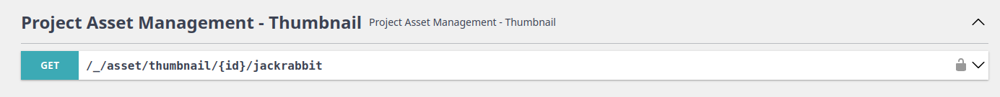

# Intro

Thumbnail Bundle is responsible for generating image thumbnails and auto-managing their life cycle. It requires
[Asset Bundle](/docs/dullahan/asset/README.md) and has build in integration with
[Entity Bundle](/docs/dullahan/entity/README.md). Currently it accepts only three types of images: JPG, PNG i WEBP
and uses Asset Bundle file system abstraction for managing generated thumbnails.

