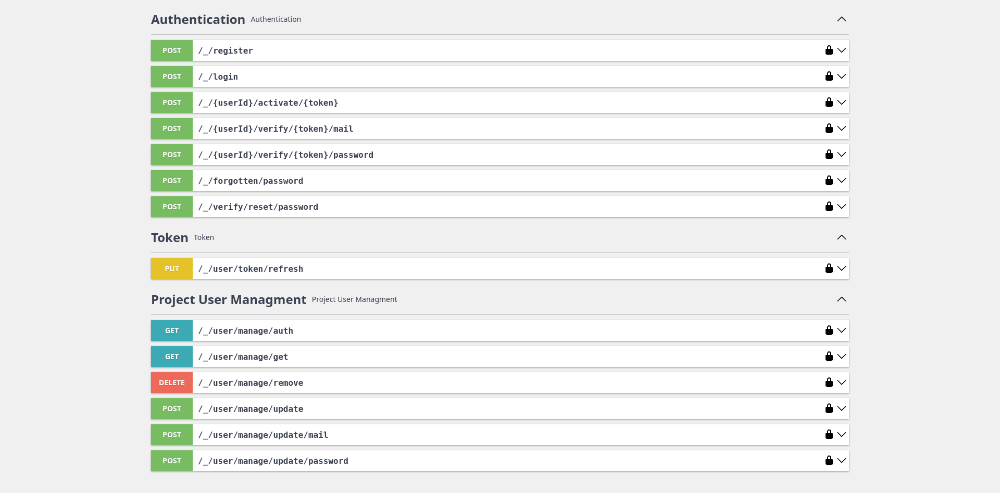

# Intro

User bundle is responsible for permissions, user registration, authorization, token generation, password resetting,
email changing, managing user data and more!

It is a full fledged SSO with Rest API for managing users for multiple platforms/domains.

