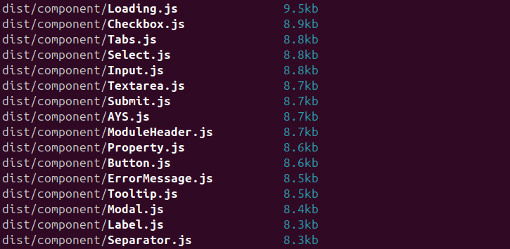
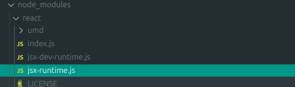
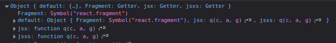
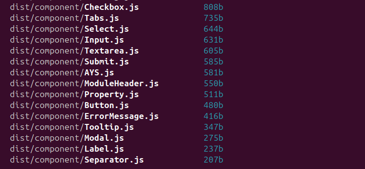

# Aliasing obscure libraries

Some libraries are obscured from sight and added in background during build process. For those we have to implement
different approach each time. This is a little showcase of how to handle such libraries to give you an idea how to
handle your issue.

## React JSX

React JSX is an example when you basically must alias it in each project where you use `.tsx` files. Otherwise it will
be including the whole React library and itself as you cannot `type` it in any way.




First a little theory - what is JSX? It's a syntax sugar to make it easier for developers to write UI straight in JS
files. But essential it is just a library hidden behind specific syntax that our bundler resolves into actual functions.
It's the same as how [TS decorators](https://www.typescriptlang.org/docs/handbook/decorators.html) work.

But it makes it quite hard to create alias map if we don't actually see what we are importing. So we have to deduct
what is being imported. To have any information we can deduct with, we should checkout the actual JS
file that `.tsx` will resolve into:

```tsx
const Label: React.FC = ({ children }) => {
  return <label>{children}</label>
};
```

Here we have a very simple React component which wraps given components in `label` tag. And it resolves to something
like this:

```js
[...]
// node_modules/react/jsx-runtime.js
var require_jsx_runtime = __commonJS({
  "node_modules/react/jsx-runtime.js"(exports, module) {
    "use strict";
    if (true) {
      module.exports = require_react_jsx_runtime_production_min();
    } else {
      module.exports = null;
    }
  }
});
[...]
// src/@component/Label.tsx
var import_jsx_runtime = __toESM(require_jsx_runtime());
var Label = ({
  children,
}) => {
  return /* @__PURE__ */ (0, import_jsx_runtime.jsxs)("label", { children });
};
var Label_default = Label;
[...]
```

Here we can see that we are using JSX library which includes itself during the build period. We know that JSX
runtime can be found in a React folder - `node_modules/react/jsx-runtime.js` - from the generated file:



Which gives as a path we can use to retrieve it:
```ts
import * as jsxRuntime from 'react/jsx-runtime';
```

You can try to run the import above and see that we are getting jsx runtime.

We know where it is, we know its name and now we can retrieved it and log it into a browser to see what are the actual
exports are:



With this we have all information we needed and now can create an alias map for the JSX to tell our bundler that it is
included externally as `jsxRuntime` constant.

```ts title="jsx.alias.ts"
import type * as Runtime from 'react/jsx-runtime';

declare const jsxRuntime: typeof Runtime;

export const jsx = jsxRuntime.jsx;
export const jsxs = jsxRuntime.jsxs;
export const Fragment = jsxRuntime.Fragment;

export default jsxRuntime;
```

```js title="esbuild.config.mjs"
aliasPlugin({
    'react/jsx-runtime': resolve(__dirname, './jsx.alias'),
    // If you are also aliasing react than remember that order matters!
    // firstly alias the lowest submodules then go up
    'react': resolve(__dirname, './react.alias'),
}),
```

Now we can create our components free of external libraries. Here is an actual plugin definition already converted to JS:

```js
// jsx.alias.ts
var jsx = jsxRuntime.jsx;
var jsxs = jsxRuntime.jsxs;
var Fragment = jsxRuntime.Fragment;

// src/@component/Label.tsx
var Label = ({
  children,
}) => {
  return /* @__PURE__ */ jsx("label", { children });
};
var Label_default = Label;
```
And have a look at how the components thinned:


